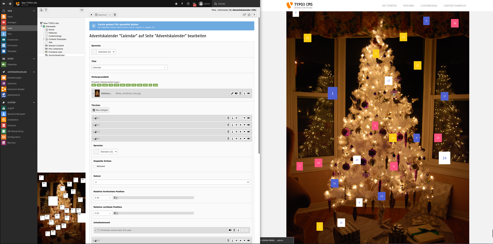

.. ==================================================
.. FOR YOUR INFORMATION
.. --------------------------------------------------
.. -*- coding: utf-8 -*- with BOM.

.. include:: ../Includes.txt

.. _introduction:

Introduction
============

.. _what-it-does:

What does it do?
----------------

This is a advent calendar for TYPO3. Let your visitors open a new door each day of december until christmas day. You can 'fill' the doors with your content elements. They will pop up as an overlay.

Have a treat for your audience each day of december until christmas.

The numbers on the doors are the days of the month. Your visitors can only open the past doors or the the door of today. To see what comes next they have to come back.

The advent calendar would have typically 24 doors and is only used in december but this extension has no such limitations. Use it when ever you want. You can even have multiple calendars.

You can position the doors freely on a image backdrop.

.. important::

   Please don't forget to repeat your extension's version number in the
   :file:`Settings.yml` file, in the :code:`release` property. It will be
   automatically picked up on the cover page by the :code:`|release|`
   substitution.

.. _screenshots:

Screenshots
-----------

You might get a good impression here:

   On the right you can get an idea of the frontend. On the left is how it looks on the backend.
